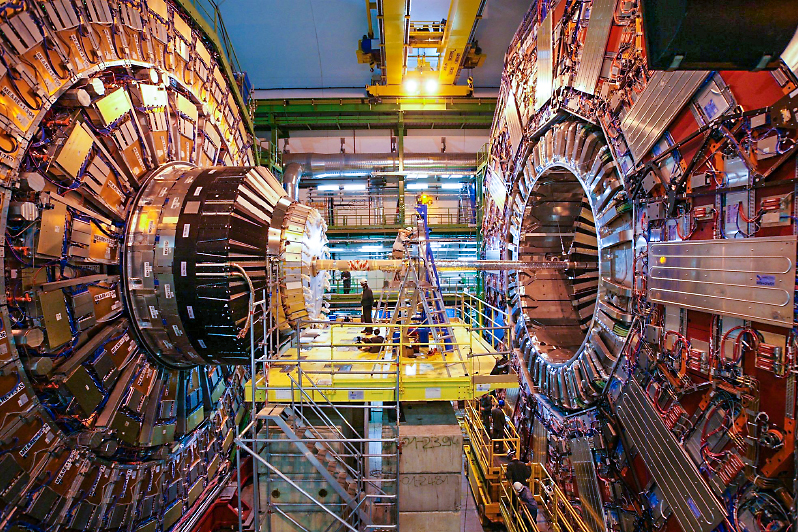

# Welcome to the UC San Diego CMS T2 User Analysis Facility (UAF) Documentation

Welcome to the High Energy Physics User Analysis Facility at UC San Diego, part of the CMS Tier-2 computing infrastructure. We provide advanced computational resources and expert support for high energy physics research, particularly focused on CMS experiment data analysis. 

## About the CMS T2 Facility

The UCSD CMS T2 center is one of the primary Tier-2 computing facilities in the United States supporting research for the Compact Muon Solenoid (CMS) experiment at CERN's Large Hadron Collider. Our facility offers:

- High-performance computing clusters with modern AMD EPYC processors
- Extensive CEPH distributed storage systems for managing petabyte-scale datasets
- HTCondor batch system for efficient job submission and processing
- Specialized tools for CMS data analysis including CMSSW support
- Integration with global CMS computing resources through Grid infrastructure

## Getting Started

If you're new to the UCSD UAF, please start with our [Requesting an Account](quickstart/requesting_account.md) guide, followed by [Accessing the UAF](quickstart/accessing_uaf.md). 

For returning users, you may want to explore our documentation on [HTCondor](setup/condor.md), [CEPH storage](setup/ceph.md), or [Docker containers](misc/using_docker.md).