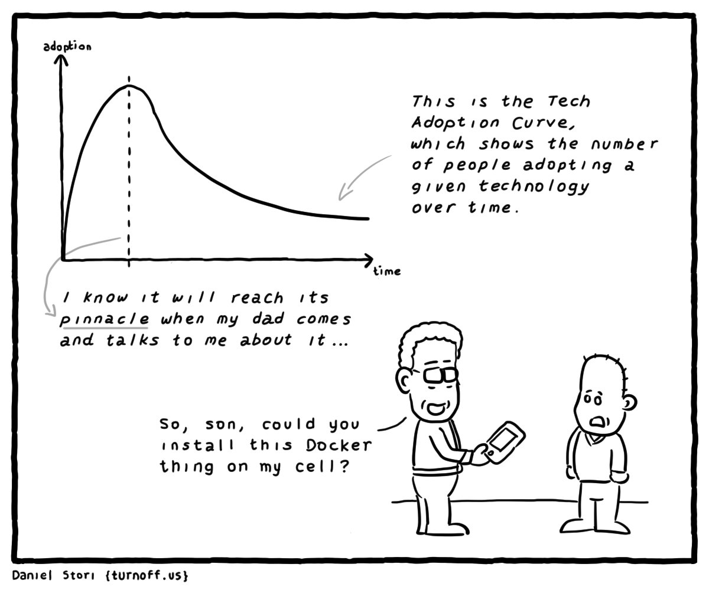

# Using Docker on UAF-2,3 and 4

Want to test an application without installing all the dependencies on your system? How about Containers?



Docker is a container engine that provides a command-line interface for managing containers and images. UAFs do not give you access to Docker, we instead use Podman which is an alternative to Docker and offers a rootless, lightweight and secure container runtime environment. To maintain familiarity, the 'docker' command these machines is aliased to 'podman', ensuring users can use their usual Docker commands seamlessly.

This guide will walk you through the steps to use Docker(Podman) on UAF-2,3, and 4 machines.

## Setting Up Docker

By default, the image storage directory for your podman profile is set to \$HOME/.local/share/containers/storage. Without any modifications, this will work **but it will store and read images from a network mounted storage system which can be very slow**. To circumvent this problem, you can create a symlink from the NVMe drive on the host itself by following these instructions:

1) If you haven't already created a directory for yourself on the NVMe, do so by running
    ```
    $ mkdir -p /data/userdata/${USER}
    $ mkdir /data/userdata/${USER}/docker
    ```
2) You can now create a symlink to the image storage directory using
    ```
    $ ln -s /data/userdata/${USER}/docker $HOME/.local/share/containers/storage
    ```
3) Verify that the symlink was created by running `ls -l $HOME/.local/share/containers`, the output should look like
    ```
    [0356] aaarora@uaf-2 ~$ ls -l $HOME/.local/share/containers
    total 0
    drwx------ 2 aaarora aaarora 47 May 31  2023 cache
    lrwxrwxrwx 1 aaarora aaarora 29 Mar 22 05:56 storage -> /data/userdata/aaarora/docker
    ```

## Basic Usage

You can now start using Docker to manage containers and images. Here are some basic commands to get you started:

- To run a container, use the `docker run` command followed by the name of the image you want to run. For example:
  ```
  $ docker run -it ubuntu:latest
  ```

- To list all running containers, use the `docker ps` command:
  ```
  $ docker ps
  ```

- To stop a running container, use the `docker stop` command followed by the container ID or name:
  ```
  $ docker stop <container_id>
  ```

- To remove a container, use the `docker rm` command followed by the container ID or name:
  ```
  $ docker rm <container_id>
  ```

- To pull an image from a registry, use the `docker pull` command followed by the image name:
  ```
  $ docker pull nginx:latest
  ```

## Advanced Usage

Podman provides many advanced features for managing containers and images. Here are a few examples:

- To create a new container, use the `docker create` command followed by the image name:
  ```
  $ docker create nginx:latest
  ```

- To start a stopped container, use the `docker start` command followed by the container ID or name:
  ```
  $ docker start <container_id>
  ```

- To inspect a container, use the `docker inspect` command followed by the container ID or name:
  ```
  $ docker inspect <container_id>
  ```

- To build a new image from a Dockerfile, use the `docker build` command followed by the path to the Dockerfile:
  ```
  $ docker build -t myimage:latest .
  ```

- To push an image to a container registry, use the `docker push` command
  ```
  $ docker push username/myimage:tag
  ```

With Docker (Podman), you can easily manage containers and images on UAF-2,3, and 4 machines. This guide covered the basics of using Podman, but there are many more features and options available. Refer to the official Podman documentation for more information and explore the possibilities of containerization with Podman.